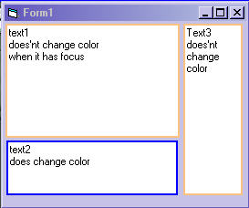



## TextboxBorder

### Description

I was just playing around and thought this would be useful for something.It places a colored border around the dull looking textbox.I've updated the ocx with more propertys so try it out.
 
### More Info
 

             |
---                |---
**Submitted On**   |2004-02-17 21:47:24
**By**             |[Kenneth Foster](https://github.com/Planet-Source-Code/PSCIndex/blob/master/ByAuthor/kenneth-foster.md)
**Level**          |Beginner
**User Rating**    |4.3 (60 globes from 14 users)
**Compatibility**  |VB 6\.0
**Category**       |[Custom Controls/ Forms/  Menus](https://github.com/Planet-Source-Code/PSCIndex/blob/master/ByCategory/custom-controls-forms-menus__1-4.md)
**World**          |[Visual Basic](https://github.com/Planet-Source-Code/PSCIndex/blob/master/ByWorld/visual-basic.md)
**Archive File**   |[TextboxBor1710222172004\.zip](https://github.com/Planet-Source-Code/kenneth-foster-textboxborder__1-51810/archive/master.zip)

